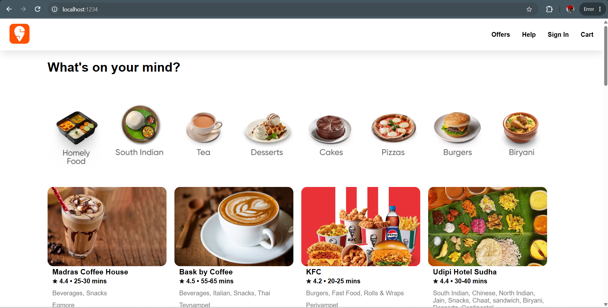

# 🍽️ Restaurant Listing App (React + Parcel)

A simple React application that displays restaurant cards with details like image, rating, cuisines, and location. Built while learning React fundamentals such as components, props, and project structure.

---

## 🚀 Features

* 📦 Component-based architecture
* 🖼️ Dynamic restaurant cards
* 🔗 CDN-based image loading
* 🧩 Clean folder structure (assets, components, utilities)
* ⚡ Built using Parcel bundler

---

## 🛠️ Tech Stack

* **Frontend:** React.js
* **Bundler:** Parcel
* **Language:** JavaScript (ES6+)
* **Styling:** CSS

---

## 🖼️ Screenshots



---

## 📦 Installation & Setup

1. Clone the repository:

```
git clone https://github.com/IsraelRufus-RJ/react-insta-food
```

2. Navigate to project folder:

```
cd react-insta-food
```

3. Install dependencies:

```
npm install
```

4. Run the app:

```
npm start
```
---

## 🌐 Future Improvements

* 🔍 Search functionality
* 📱 Responsive design
* ⚛️ Add Hooks (useState, useEffect)
* 🌍 API integration for real restaurant data

---

## 🙌 Author

**Israel Rufus**

* GitHub: https://github.com/IsraelRufus-RJ
* LinkedIn: https://linkedin.com/in/israelrufus

---

## ⭐ Show your support

If you like this project, give it a ⭐ on GitHub!

---